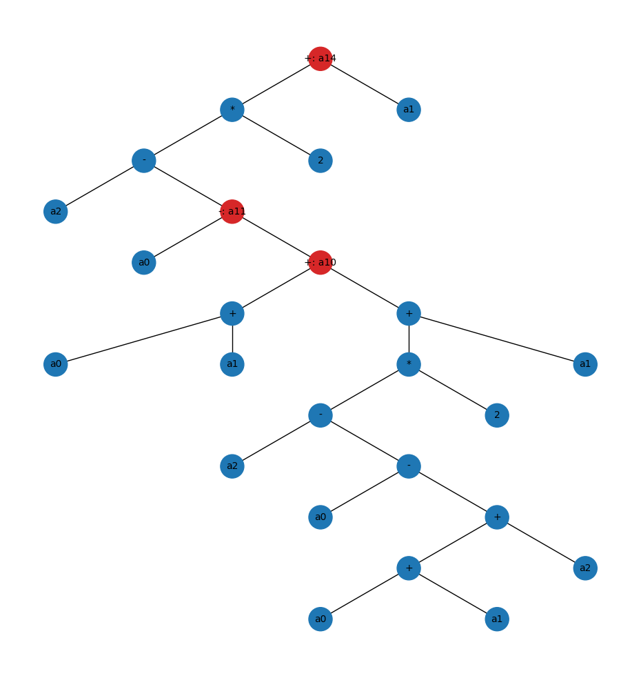
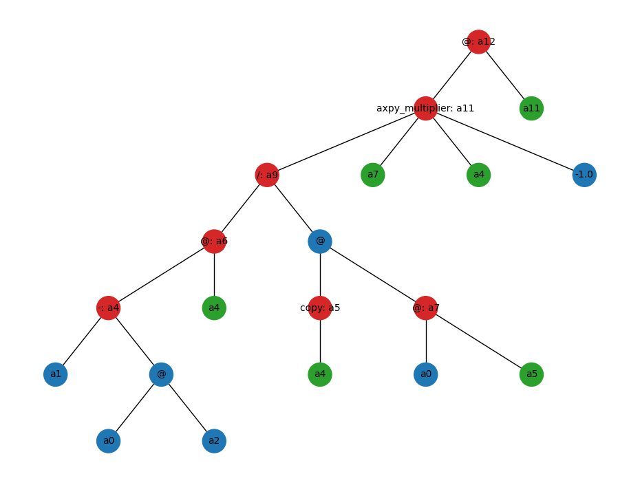

charmtiles
==========

:code:`charmtiles` is a python interface to a C++ distributed array library
implemented using Charm++ [#charm]_.
charmtiles uses a client-server model with a client-side python
interface and a Charm++ server on the backend. The client and server
are connected using CCS [#ccs]_.
The server maintains a symbol table of distributed arrays which
are then looked up for computation when a CCS message is
received.

:code:`charmtiles.array`
----------------------

.. highlight:: python

:code:`charmtiles.array.ndarray`, analogous to :code:`numpy.ndarray`, is a proxy
object that wraps the name of the corresponding array on the server.
We use a lazy evaluation scheme for array computations. 
The array operations incrementally build an AST which is stored in a buffer in the
:code:`ndarray` object. This AST is encoded into a CCS message when
either the data from the array is requested on the frontend or
when the size of the AST grows beyond a user configurable
threshold.
The server side Charm++ program decodes the CCS message and
rebuilds the AST which is then executed. 

The lazy evaluation scheme reduces the number of CCS messages required to 
be sent from the client to the server. 
It also helps in reducing the number of temporary arrays created on the 
server side by accessing the reference counts of the frontend arrays in
the python runtime. For example::

   v = ndarray(1, 10, np.float64)
   b = ndarray(1, 10, np.float64)
   c = ndarray(1, 10, np.float64)
   w = c
   for i in range(2):
       y = v + b + w
       z = v - y
       w = 2 * (c - z) + b
   w.evaluate()

The above code snippet generates the following AST. Nodes with labels
starting with the letter :code:`a` are arrays. Nodes with an operation
label that are colored blue are operations that generate a temporary
array. Nodes with an operation label that are colored red are operations
that generate arrays that are to be stored on the server side.
The red node labels also show the name of the resulting array.
Note that the arrays :code:`y`, :code:`z` and :code:`w` for the first iteration 
of the loop are considered to be temporary because they are overwritten
in the next iteration. These operations will be executed inplace
on the server side.

   *AST generated by the above code snippet*

Here's another example of a conjugate gradient solver::

   def solve(A, b):
    x = ndarray(1, 1000, np.float64)
    r = b - A @ x
    p = r.copy()
    rsold = r @ r

    for i in range(1000):
        Ap = A @ p
        alpha = rsold / (p @ Ap)

        x = lg.axpy(alpha, p, x)
        r = lg.axpy(alpha, Ap, r, multiplier=-1.)

        rsnew = r @ r

        if np.sqrt(rsnew.get()) < 1e-8:
            print("Converged in %i iterations" % (i + 1))
            break

        p = lg.axpy(rsnew / rsold, p, r)
        rsold = rsnew

    return x

This generates the following AST,

   *AST generated by the conjugate gradient example*

Here the green nodes are arrays that do not exist on the server when the AST is
sent, but will be created and stored as a result of an operation in the current
AST before being referenced.

References
----------

.. [#charm] Charm++ Documentation - https://charm.readthedocs.io/en/latest/
.. [#ccs] CCS Documentation - https://charm.readthedocs.io/en/latest/converse/manual.html?converse-client-server-interface#converse-client-server-interface

